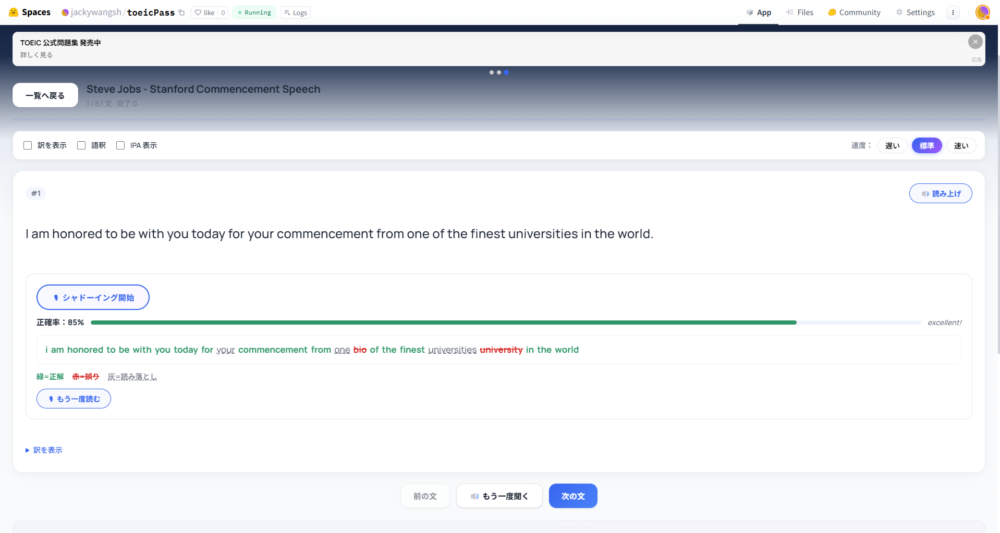
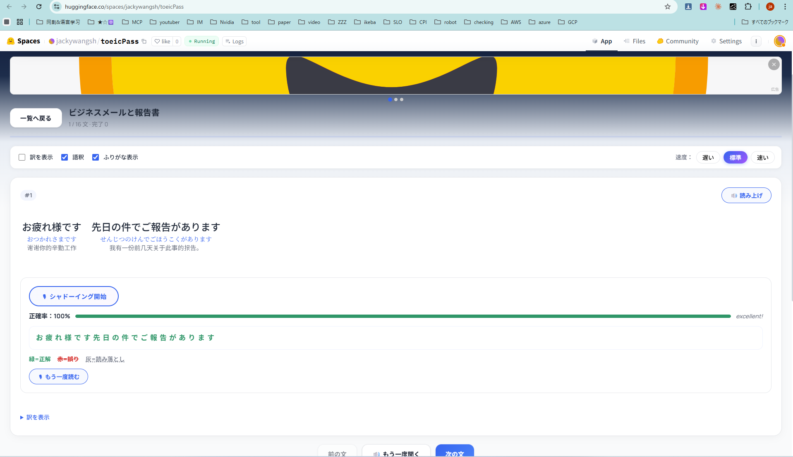
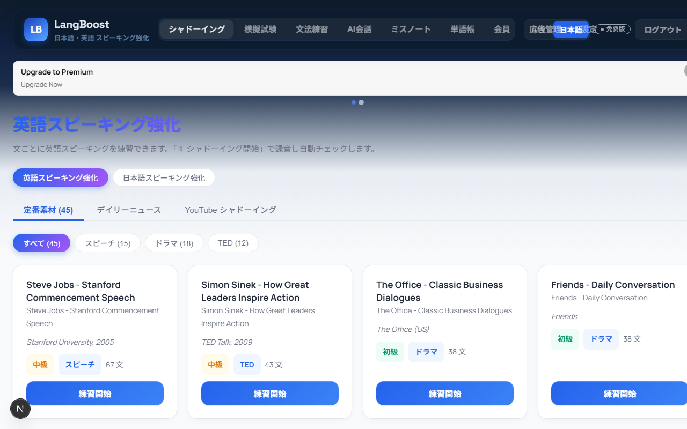
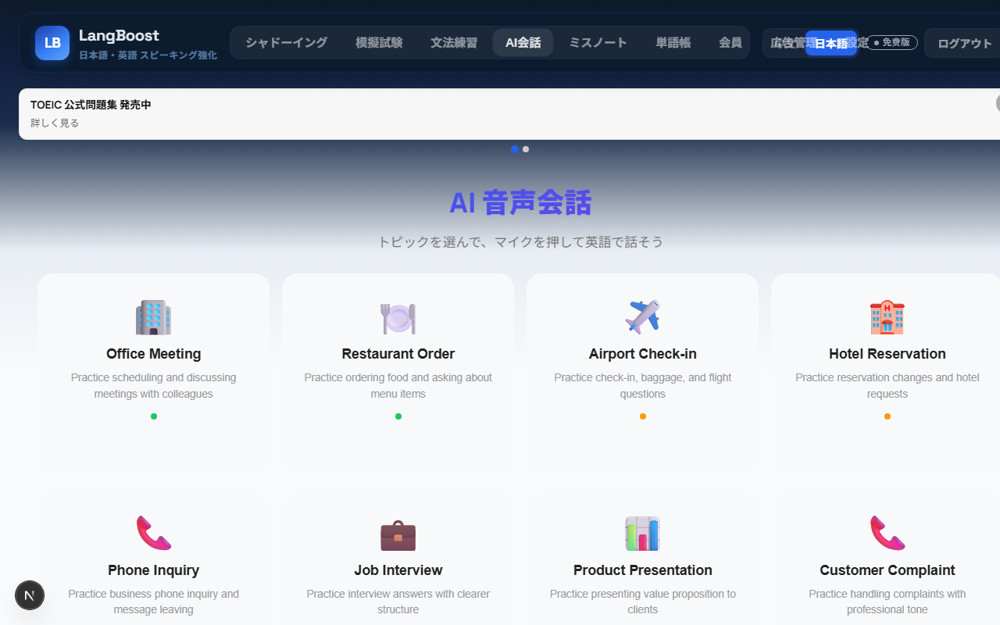

# LangBoost — Japanese & English Speaking Practice Platform

[**Live Demo on Hugging Face**](https://huggingface.co/spaces/jackywangsh/toeicPass) · [**GitHub**](https://github.com/zixuniaowu/toeicPass)

An AI-powered multilingual speaking practice platform with sentence-by-sentence shadowing, tap-to-translate, pronunciation feedback, grammar drills, vocabulary flashcards, mock exams, and AI conversation.

---

## Key Features

### Shadowing Training

The core feature of LangBoost is **sentence-by-sentence shadowing** with real-time pronunciation correction for both Japanese and English.

#### English Shadowing — Pronunciation Feedback

Record your voice and instantly see color-coded feedback: **green** = correct, **red** = mispronounced, gray = missed. The accuracy score shows your progress.



> *Steve Jobs' Stanford Speech — "bio" was mispronounced (should be "one"), "university" was misread. Accuracy: 85%*

#### Japanese Shadowing — Furigana & Translation

Japanese sentences display **furigana** (reading annotations) above kanji and **Chinese translations** below. Toggle these on/off with checkboxes.



> *Business email practice — full furigana + Chinese translation displayed, 100% pronunciation accuracy*

#### More Shadowing Features

- **YouTube Shadowing** — Auto-fetch subtitles from any YouTube video for sentence-by-sentence repeat-after practice
- **Tap-to-Translate** — Tap any word to see its translation and hear its pronunciation
- **English IPA Phonetics** — Per-word IPA transcription displayed inline
- **Cinema Mode** — Immersive split-screen with video + highlighted subtitles
- **Speed Control** — Slow / Normal / Fast playback for each sentence
- **Curated Content** — TED Talks, news, drama dialogues, famous speeches (Steve Jobs, Simon Sinek, etc.)



### AI Conversation



### AI Conversation

Practice real-world scenarios with AI-powered dialogue:

- Office meetings, restaurant orders, airport check-in, job interviews, and more
- Multi-turn conversation with real-time speaking practice
- AI-driven error analysis and explanations

### TOEIC Exam Prep

- Part 1–7 section practice with adaptive difficulty
- Full mock exams with score conversion and per-section feedback
- Mistake notebook with spaced repetition cards
- Score prediction and plateau alerts

### Vocabulary & Grammar

- SRS-based flashcards for vocabulary review
- Grammar drills with structured exercises
- Spaced repetition scheduling for optimal retention

### Learning Analytics

- Accuracy, pace, and retention trends per section
- Score prediction using recent mock data and error distribution
- Schedule deviation and plateau alerts

---

## Screenshots

| English Pronunciation Feedback | Japanese Furigana + Translation |
|:---:|:---:|
|  |  |

| Shadowing Library | AI Conversation Scenarios |
|:---:|:---:|
|  |  |

---

## Architecture

```
langboost/
├── apps/
│   ├── api/               NestJS REST API (port 8001)
│   └── web/               Next.js 15 frontend (port 8000)
├── packages/
│   ├── ad-system/         Ad placement system
│   ├── conversation-ai/   AI conversation engine
│   └── shared/            Shared types & utilities
├── db/                    PostgreSQL schema + migrations
└── docs/                  Architecture & design docs
```

| Layer | Stack |
|-------|-------|
| API | NestJS, TypeScript, JWT + RBAC, multi-tenant |
| Web | Next.js 15, React, CSS Modules |
| DB | PostgreSQL 15+ (PGLite for tests) |
| Analytics | Umami (privacy-friendly) |
| CI/CD | GitHub Actions → Hugging Face Spaces |
| Container | Docker (Node 20) |

---

## Getting Started

```bash
# Install dependencies
npm install

# Start dev servers (API + Web)
npm run dev

# Or start individually
npm run dev:api      # API only (port 8001)
npm run dev:web:hot  # Web only (port 8000)
```

| URL | Description |
|-----|-------------|
| `http://localhost:8000` | Web frontend |
| `http://localhost:8001/api/v1` | REST API |

## Commands

| Command | Description |
|---------|-------------|
| `npm run dev` | Development mode (API + Web) |
| `npm run build` | Production build |
| `npm test` | Run test suite |
| `npm run lint` | TypeScript type checking |
| `npm run db:migrate` | Run database migrations |

## Environment Variables

| Variable | Default | Description |
|----------|---------|-------------|
| `PORT` | `8001` | API listen port |
| `JWT_SECRET` | `dev-secret` | JWT signing key |
| `WEB_ORIGIN` | `http://localhost:3000` | CORS allowed origin |
| `DATABASE_URL` | — | PostgreSQL connection string |
| `NEXT_PUBLIC_UMAMI_WEBSITE_ID` | — | Umami analytics website ID |

## Deployment

### Docker

```bash
docker build -t langboost .
docker run -p 7860:7860 langboost
```

### Hugging Face Spaces

Every push to `main` auto-syncs to Hugging Face Spaces.

Required GitHub secrets: `HF_TOKEN`, `HF_REPO_ID`

## Documentation

- [System Blueprint](docs/system-blueprint.md) — Architecture and product goals
- [API Contract](docs/api-contract-v1.md) — REST API specification
- [Official Question Sources](docs/official-question-sources.md) — Licensed content guidelines

## License

[Business Source License 1.1 (BUSL-1.1)](LICENSE)

You may view, fork, and modify the code for non-commercial purposes (personal learning, academic research, contributions). Commercial use requires a separate license. On **April 18, 2029**, the license automatically converts to Apache 2.0.
