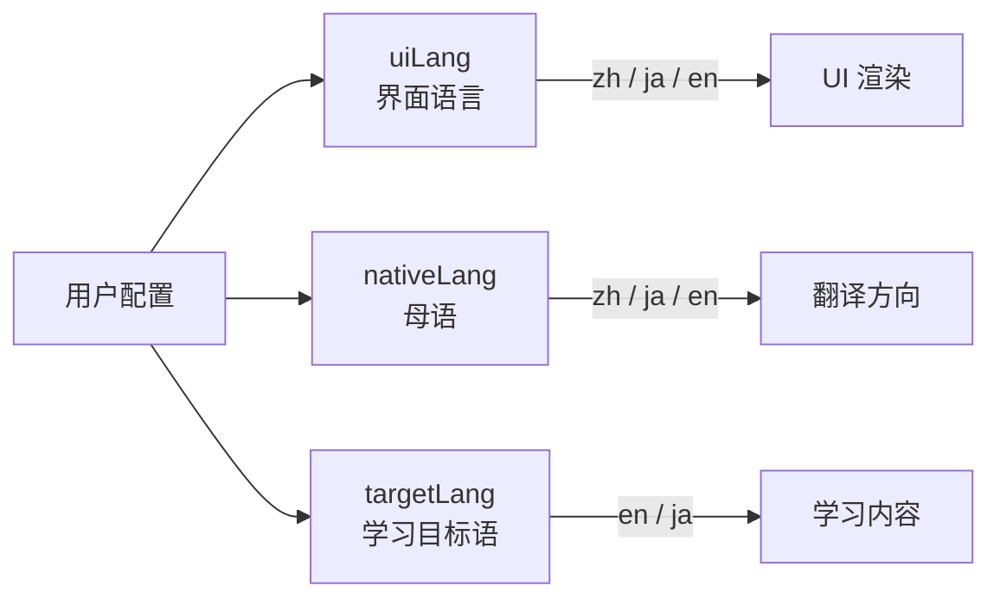

# LangBoost 多语言架构重构方案

> 2026-04-18 · 设计文档 · 状态：Draft

---

## 1. 问题分析

### 1.1 当前系统的语言维度

系统存在两个独立但目前混杂的语言概念：

| 概念 | 当前实现 | 位置 |
|---|---|---|
| **UI 语言** (interface language) | `Locale = "zh" \| "ja"` | `packages/shared`, 全部 15+ 组件 |
| **学习目标语言** (target language) | `TrainingLanguage = "en" \| "ja"` | 仅 `ShadowingView` |

### 1.2 当前的 i18n 模式

```typescript
// 模式 A: COPY 对象 (15 个组件)
const COPY = {
  zh: { title: "设置", save: "保存" },
  ja: { title: "設定", save: "保存" },
};
const copy = COPY[locale];

// 模式 B: 内联 l() 函数 (ShadowingView)
const l = (zh: string, ja: string) => (isJa ? ja : zh);
```

**问题**：没有英语 UI、没有中心化翻译系统、两个维度混合在一起。

### 1.3 用户画像 × 语言矩阵

```
                    学习目标语言 (Target)
                    English    Japanese
母语/UI偏好    ┌──────────┬──────────┐
  Chinese (zh) │ ✅ 完整   │ ⚠️ 仅跟读  │
  Japanese (ja)│ ✅ 完整   │    N/A     │
  English (en) │    N/A    │ ❌ 不存在   │
               └──────────┴──────────┘
```

用户求的两大方向：
1. **英/中母语 → 学日语** (英语 UI + 日语学习内容)
2. **日/中母语 → 学英语** (已基本覆盖，但缺英语 UI)

---

## 2. 目标架构

### 2.1 三维语言模型



| 维度 | 类型 | 说明 |
|---|---|---|
| `uiLang` | `"zh" \| "ja" \| "en"` | 界面显示语言 |
| `nativeLang` | `"zh" \| "ja" \| "en"` | 用户母语（决定翻译目标、释义语言） |
| `targetLang` | `"en" \| "ja"` | 学习目标语言（决定内容方向） |

### 2.2 用户场景映射

| 场景 | `uiLang` | `nativeLang` | `targetLang` | 能力模块 |
|---|---|---|---|---|
| 中国人学英语 (TOEIC) | zh | zh | en | 全部 |
| 日本人学英语 (TOEIC) | ja | ja | en | 全部 |
| 中国人学日语 | zh | zh | ja | 跟读 + 会话 + 词汇 |
| 英语母语学日语 | en | en | ja | 跟读 + 会话 + 词汇 |
| 日本人学日语 | — | — | — | 不需要 |
| 中国人用英语 UI | en | zh | en | 全部 (翻译仍显示中文) |

### 2.3 关键设计决策

#### 原则 1: `uiLang` 和 `nativeLang` 通常相同，但允许不同
- 默认 `nativeLang = uiLang`
- 高级设置中允许独立调整

#### 原则 2: `targetLang` 决定学习路径
- `targetLang = "en"` → TOEIC 练习 / 英语跟读 / 英语数话
- `targetLang = "ja"` → 日语跟读 / 日语会话 / 日语词汇

#### 原则 3: 渐进式改造，不大爆炸
- Phase 1: 类型系统 + 集中式 i18n
- Phase 2: 英语 UI 翻译
- Phase 3: 日语学习内容扩展

---

## 3. 类型系统重构

### 3.1 `packages/shared` 新类型

```typescript
// packages/shared/src/index.ts

/** Supported UI display languages. */
export type UiLang = "zh" | "ja" | "en";

/** User's native/primary language for translation targets. */
export type NativeLang = "zh" | "ja" | "en";

/** Languages available as learning targets. */
export type TargetLang = "en" | "ja";

/** Complete language configuration for a user session. */
export type LangConfig = {
  uiLang: UiLang;
  nativeLang: NativeLang;
  targetLang: TargetLang;
};

// deprecated, keep for backward compat during migration
/** @deprecated Use UiLang instead */
export type Locale = "zh" | "ja";
```

### 3.2 迁移策略

```
阶段                   Locale → UiLang 迁移
─────────────────────────────────────────────
Phase 1 (本次):      新增 UiLang / NativeLang / TargetLang 类型
                      保留 Locale 为 deprecated alias
Phase 2 (渐进):      各组件逐步将 locale: Locale 改为 uiLang: UiLang
                      COPY 对象增加 en: {...}
Phase 3 (清理):      删除 Locale 类型
```

---

## 4. i18n 系统重构

### 4.1 当前状态 → 目标状态

| | 当前 | 目标 |
|---|---|---|
| 翻译存储 | 每个组件的 `COPY` 对象 | 集中 JSON 文件 |
| 翻译函数 | `COPY[locale].key` / `l(zh, ja)` | `t("key")` |
| 支持语言 | zh, ja | zh, ja, en |
| 类型安全 | 部分 (COPY 有类型) | 完整 (key 级别 autocomplete) |

### 4.2 推荐方案: 轻量 t() 函数

不引入 react-intl/i18next 等重型库，保持零依赖风格：

```typescript
// apps/web/lib/i18n.ts

import zh from "../locales/zh.json";
import ja from "../locales/ja.json";
import en from "../locales/en.json";

const dictionaries = { zh, ja, en } as const;
type TranslationKey = keyof typeof zh;

export function createT(lang: UiLang) {
  const dict = dictionaries[lang];
  return (key: TranslationKey, params?: Record<string, string | number>) => {
    let text = dict[key] ?? zh[key] ?? key;
    if (params) {
      for (const [k, v] of Object.entries(params)) {
        text = text.replace(`{${k}}`, String(v));
      }
    }
    return text;
  };
}
```

```typescript
// apps/web/locales/zh.json
{
  "settings.title": "账户与目标设置",
  "settings.account": "账户",
  "settings.save": "保存目标",
  "shadowing.title": "口语强化",
  "shadowing.progress": "已完成 {done}/{total} 句",
  ...
}

// apps/web/locales/ja.json
{
  "settings.title": "アカウントと目標設定",
  "settings.account": "アカウント",
  "settings.save": "目標保存",
  "shadowing.title": "スピーキング強化",
  "shadowing.progress": "完了 {done}/{total} 文",
  ...
}

// apps/web/locales/en.json
{
  "settings.title": "Account & Goal Settings",
  "settings.account": "Account",
  "settings.save": "Save Goal",
  "shadowing.title": "Speaking Practice",
  "shadowing.progress": "Completed {done}/{total} sentences",
  ...
}
```

### 4.3 组件迁移示例

```diff
- const COPY = {
-   zh: { title: "设置", save: "保存" },
-   ja: { title: "設定", save: "保存" },
- };
- const copy = COPY[locale];
- return <h1>{copy.title}</h1>;

+ const t = createT(uiLang);
+ return <h1>{t("settings.title")}</h1>;
```

---

## 5. 内容系统重构

### 5.1 跟读材料 (Shadowing)

当前结构:
```typescript
type ShadowingSentence = {
  text: string;          // 目标语言文本 (English 或 Japanese)
  translation: string;   // 中文翻译
  translationEn?: string; // 英文翻译 (可选)
};
```

改为:
```typescript
type ShadowingSentence = {
  text: string;              // 目标语言文本
  translations: {
    zh?: string;             // 中文翻译
    ja?: string;             // 日文翻译
    en?: string;             // 英文翻译
  };
  startSec?: number;
  endSec?: number;
};
```

这样 `nativeLang` 决定显示哪个翻译：
```typescript
const getTranslation = (s: ShadowingSentence) =>
  s.translations[nativeLang] ?? s.translations.zh ?? "";
```

### 5.2 词汇系统 (Vocab)

当前：词汇释义只有中文 (`cn` 字段) + 可选的日文翻译。

改为：
```typescript
type VocabDefinition = {
  word: string;
  ipa: string;
  definitions: {
    zh?: string;
    ja?: string;
    en?: string;  // 英语释义 (用于 en 母语 → 日语学习)
  };
};
```

### 5.3 会话练习 (Conversation AI)

当前 `ConversationScenario` 已经有多语场景标题（`title` + `titleCn`）。

扩展为：
```typescript
interface ConversationScenario {
  id: string;
  title: string;         // 目标语言标题
  titles: {
    zh?: string;
    ja?: string;
    en?: string;
  };
  // ...
  targetLanguage: "en" | "ja";  // 新增：该场景的目标语言
}
```

需要新增 **日语版会话场景**：日语对话练习 (用 Gemini 生成日语回复 + 纠错)。

---

## 6. 功能模块 × 目标语言 矩阵

| 模块 | targetLang=en | targetLang=ja | 改动量 |
|---|---|---|---|
| Dashboard | ✅ 已有 | 需新建日语版 | 中 |
| Listening (Part 1-4) | ✅ 已有 | 不适用 | 无 |
| Grammar (Part 5) | ✅ 已有 | 可复用框架做日语文法 | 大 |
| Text Completion (Part 6) | ✅ 已有 | 不适用 | 无 |
| Reading (Part 7) | ✅ 已有 | 可复用做日语阅读 | 大 |
| **Shadowing** | ✅ 已有 | ✅ 已有 | 小 (翻译结构) |
| Mock Exam | ✅ 已有 | 可做 JLPT 模拟 | 大 |
| Mistakes | ✅ 已有 | 需泛化 | 小 |
| Vocab | ✅ 已有 | 需扩展日语词汇 | 中 |
| Writing | ✅ 已有 | 需日语版 | 中 |
| **Conversation AI** | ✅ 已有 | 需日语场景 | 中 |
| Settings | UI 改动 | UI 改动 | 小 |
| Subscription | UI 改动 | UI 改动 | 小 |

---

## 7. 导航/路由重构

### 7.1 按目标语言切分 Tab

当前 Tab 列表对 TOEIC 硬编码（listening, grammar, textcompletion, reading, mock 都是 TOEIC 特定的）。

建议：
```typescript
const TABS_BY_TARGET: Record<TargetLang, ViewTab[]> = {
  en: [
    "dashboard", "listening", "grammar", "textcompletion", "reading",
    "shadowing", "mock", "mistakes", "vocab", "conversation",
    "writing", "settings", "subscription",
  ],
  ja: [
    "dashboard", "shadowing", "vocab", "conversation",
    "writing", "mistakes", "settings", "subscription",
  ],
};
```

Phase 2+ 可以为日语添加 grammar(文法)、reading(読解)、mock(JLPT模拟) 等。

### 7.2 语言切换器重构

当前 TopBar 有 `中文 | 日本語` 两个 UI 语言按钮。

改为：
```
┌──────────────────────────────────────────┐
│  LB  LangBoost                           │
│  [中文] [日本語] [English]  ← UI 语言     │
│                                          │
│  学习目标: [🇺🇸 English] [🇯🇵 日本語]    │
│             ← 学习目标语言 (设置/首页)     │
└──────────────────────────────────────────┘
```

---

## 8. 实施分阶段计划

### Phase 1: 类型基础 + i18n 框架 (1-2 周)

- [ ] `packages/shared`: 新增 `UiLang`, `NativeLang`, `TargetLang`, `LangConfig` 类型
- [ ] `apps/web/lib/i18n.ts`: 创建 `createT()` 函数
- [ ] `apps/web/locales/`: 提取所有 COPY 到 zh.json / ja.json
- [ ] `apps/web/locales/en.json`: 英文翻译
- [ ] `apps/web/hooks/useLangConfig.ts`: 新建语言配置 hook
- [ ] 保持 `Locale` 作为 deprecated alias，不破坏现有代码

### Phase 2: 组件迁移 (2-3 周)

- [ ] 所有 `COPY` 组件迁移到 `t()` 函数
- [ ] TopBar 支持 3 语言切换
- [ ] Settings 增加目标语言选择
- [ ] ShadowingView 翻译结构改为 `translations: { zh, ja, en }`
- [ ] Vocab 翻译结构扩展

### Phase 3: 日语学习内容 (3-4 周)

- [ ] ConversationAI 增加日语会话场景 + 日语 Gemini prompt
- [ ] 日语词汇包 (JLPT N5-N1 核心词)
- [ ] Dashboard 日语版（历史进度、推荐）
- [ ] Writing 日语版（日语作文练习）

### Phase 4: 高级功能 (可选)

- [ ] 日语文法练习 (JLPT 文法)
- [ ] 日语阅读理解
- [ ] JLPT 模拟考试
- [ ] 英语母语者专属引导流程

---

## 9. 风险与注意事项

| 风险 | 缓解策略 |
|---|---|
| 翻译提取工作量大 (~15 个组件) | 写脚本半自动提取 COPY 到 JSON |
| 英文翻译质量 | AI 生成初稿 + 人工校对 |
| 跟读材料翻译字段迁移 | 写迁移脚本转换 `translation` → `translations.zh` |
| `Locale` 类型广泛使用 | deprecated alias + codemod 渐进替换 |
| 日语内容质量 | 参考 JLPT 官方材料 + native speaker 审校 |
| ShadowingView 2400+ 行 | 先拆分组件再做 i18n (已在待办: decomposition) |

---

## 10. 文件影响清单

```
packages/shared/src/index.ts          ← 新增 UiLang, NativeLang, TargetLang
apps/web/lib/i18n.ts                  ← 新建
apps/web/locales/zh.json              ← 新建 (从 COPY 提取)
apps/web/locales/ja.json              ← 新建
apps/web/locales/en.json              ← 新建
apps/web/hooks/useLangConfig.ts       ← 新建
apps/web/types/index.ts               ← 新增导出
apps/web/components/layout/TopBar.tsx  ← 三语切换
apps/web/components/ClientHome.tsx     ← LangConfig 集成
apps/web/components/settings/SettingsView.tsx ← 目标语言选择
apps/web/data/shadowing-materials.ts   ← translations 结构
apps/web/data/japanese-shadowing-materials.ts ← 同上
packages/conversation-ai/src/types.ts  ← targetLanguage 字段
+ 15 个组件的 COPY → t() 迁移
```
