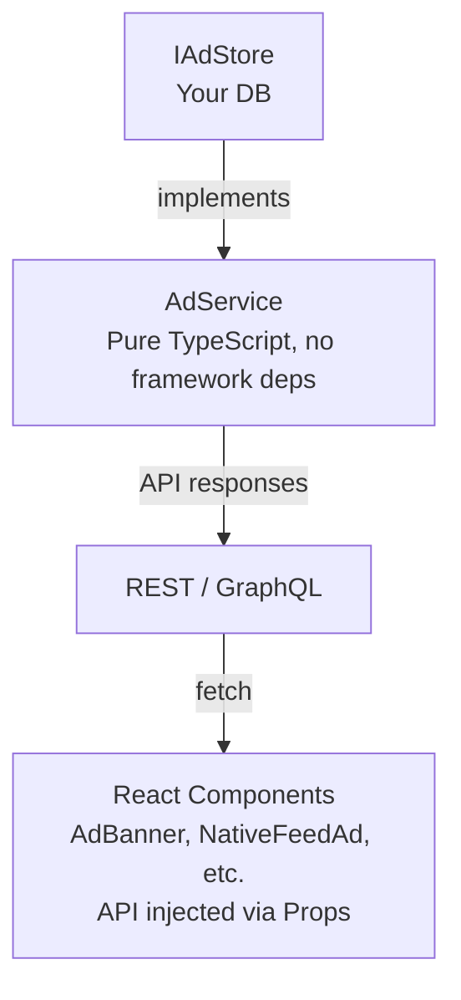

# @toeicpass/ad-system

> Reusable ad serving, event tracking & analytics module — backend service + React frontend components. Plug and play.

**Zero framework coupling** · **TypeScript** · **React (optional)** · **AdSense Waterfall**

## Docs

| Document | Description |
|---|---|
| [SPEC.md](./SPEC.md) | Full specification — all type definitions, API reference, event flows, architecture |
| [INTEGRATION.md](./INTEGRATION.md) | Step-by-step integration guide — 7 steps from install to production |
| [CHANGELOG.md](./CHANGELOG.md) | Version changelog |
| [README.md](./README.md) | Chinese (中文) version of this document |

## Quick Start

### Install

```bash
npm install @toeicpass/ad-system
```

### Backend (30 seconds)

```typescript
import { AdService, DEFAULT_AD_SEEDS } from "@toeicpass/ad-system";
import type { IAdStore } from "@toeicpass/ad-system";

// 1. Implement the store interface
const store: IAdStore = {
  adPlacements: [],
  adEvents: [],
  persistSnapshot: () => { /* write to DB */ },
};

// 2. Create the service
const adService = new AdService(store);

// 3. Seed bootstrap data
adService.seedIfEmpty(DEFAULT_AD_SEEDS);

// 4. Use it
const ads = adService.getAdsForUser("free", "banner_top");
adService.recordAdEvent(ads[0].id, "user-123", "impression");
```

### Frontend (30 seconds)

```tsx
import { AdBanner, NativeFeedAd } from "@toeicpass/ad-system/web";
import type { AdApiFunctions } from "@toeicpass/ad-system/web";

const api: AdApiFunctions = {
  fetchAds: (slot?) => fetch(`/api/ads?slot=${slot ?? ""}`).then(r => r.json()),
  recordAdEvent: (id, type) => fetch(`/api/ads/${id}/event`, {
    method: "POST",
    headers: { "Content-Type": "application/json" },
    body: JSON.stringify({ eventType: type }),
  }).then(() => {}),
};

<AdBanner locale="zh" showAds={true} api={api} />
<NativeFeedAd locale="zh" showAds={true} api={api} />
```

## Architecture



## Features

| Feature | Description |
|---|---|
| 4 ad slots | `banner_top` · `interstitial` · `native_feed` · `reward_video` |
| Plan targeting | Show different ads based on user plan (free/basic/premium) |
| Time-windowed scheduling | Control delivery periods via `startsAt` / `expiresAt` |
| Event tracking | `impression` · `click` · `dismiss` · `reward_complete` |
| CTR analytics | Per-slot impressions/clicks/CTR breakdown |
| AdSense waterfall | Prioritize in-house ads, fall back to Google AdSense |
| Admin panel | Full CRUD + analytics dashboard (React components) |
| Seed data | 7 pre-configured ads, one-line bootstrap |
| Bilingual UI | Chinese (zh) + Japanese (ja) |

## Backend Only?

No React required. The backend is pure TypeScript with zero web framework or UI library dependencies.

```typescript
import { AdService } from "@toeicpass/ad-system";
// React is an optional peerDependency — no error if not installed
```

## API Reference

### Backend Exports (`@toeicpass/ad-system`)

| Export | Kind | Description |
|---|---|---|
| `AdService` | Class | Core ad service with user-facing and admin operations |
| `DEFAULT_AD_SEEDS` | Constant | 7 pre-configured ad placements for bootstrapping |
| `AdSlot` | Type | `"banner_top" \| "interstitial" \| "native_feed" \| "reward_video"` |
| `AdEventType` | Type | `"impression" \| "click" \| "dismiss" \| "reward_complete"` |
| `AdPlacement` | Interface | Full ad placement record |
| `AdEvent` | Interface | Ad event record |
| `AdStats` | Interface | Aggregated analytics result |
| `IAdStore` | Interface | Storage abstraction (host app implements this) |
| `AdServiceConfig` | Interface | Optional service configuration |
| `CreateAdInput` | Interface | DTO for creating an ad |
| `UpdateAdInput` | Interface | DTO for updating an ad |
| `RecordAdEventInput` | Interface | DTO for recording an event |

### Frontend Exports (`@toeicpass/ad-system/web`)

| Export | Kind | Description |
|---|---|---|
| `AdBanner` | Component | Top/bottom banner ad |
| `NativeFeedAd` | Component | In-feed native ad |
| `InterstitialAd` | Component | Full-screen interstitial ad |
| `RewardVideoAd` | Component | Reward video ad trigger |
| `GoogleAdUnit` | Component | Google AdSense fallback unit |
| `AdManagerView` | Component | Admin CRUD + analytics dashboard |
| `AdApiFunctions` | Type | API callback interface for user-facing components |
| `AdminAdApiFunctions` | Type | API callback interface for admin components |

## License

MIT
