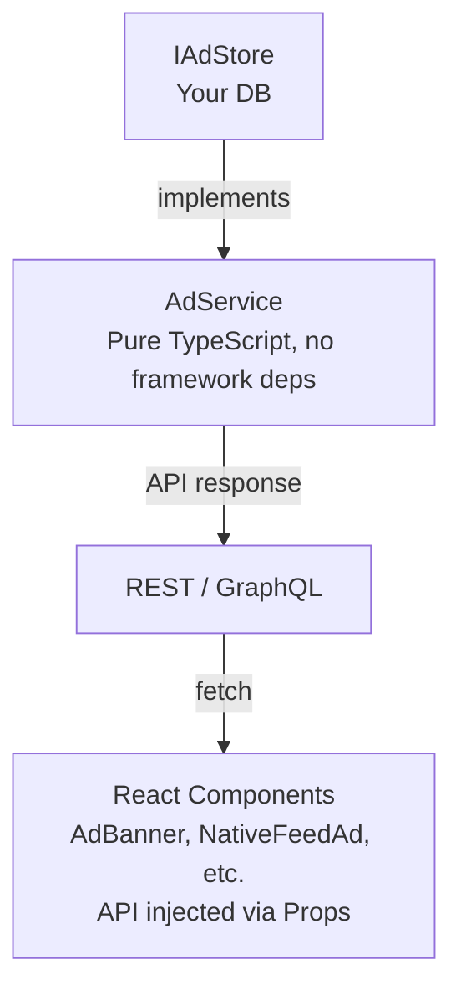

# @toeicpass/ad-system

> Reusable ad serving, event tracking and analytics module — backend service + React frontend components.

**Framework-agnostic** · **TypeScript** · **React (optional)** · **AdSense Waterfall**

## Documentation

| Document | Description |
|---|---|
| [SPEC.md](./SPEC.md) | Full specification — all type definitions, API reference, event flow, architecture diagram |
| [INTEGRATION.md](./INTEGRATION.md) | Step-by-step integration guide — 7 steps from install to production |
| [CHANGELOG.md](./CHANGELOG.md) | Version changelog |

## Installation

```bash
npm install @toeicpass/ad-system
```

Or via monorepo workspace reference:
```json
{ "dependencies": { "@toeicpass/ad-system": "workspace:*" } }
```

## Quick Start — Backend

```typescript
import { AdService, DEFAULT_AD_SEEDS } from "@toeicpass/ad-system";
import type { IAdStore } from "@toeicpass/ad-system";

// 1. Implement the storage interface
const store: IAdStore = {
  adPlacements: [],
  adEvents: [],
  persistSnapshot: () => { /* write to DB */ },
};

// 2. Create the service
const adService = new AdService(store);

// 3. Seed initial data
adService.seedIfEmpty(DEFAULT_AD_SEEDS);

// 4. Use it
const ads = adService.getAdsForUser("free", "banner_top");
adService.recordAdEvent(ads[0].id, "user-123", "impression");
```

## Quick Start — Frontend

```tsx
import { AdBanner, NativeFeedAd } from "@toeicpass/ad-system/web";
import type { AdApiFunctions } from "@toeicpass/ad-system/web";

const api: AdApiFunctions = {
  fetchAds: (slot?) => fetch(`/api/ads?slot=${slot ?? ""}`).then(r => r.json()),
  recordAdEvent: (id, type) => fetch(`/api/ads/${id}/event`, {
    method: "POST",
    headers: { "Content-Type": "application/json" },
    body: JSON.stringify({ eventType: type }),
  }).then(() => {}),
};

<AdBanner locale="zh" showAds={true} api={api} />
<NativeFeedAd locale="zh" showAds={true} api={api} />
```

## Architecture



### Design Principles

- **Dependency Inversion**: `AdService` depends on the `IAdStore` interface, not a concrete database. Swap PostgreSQL, Redis, or in-memory storage freely.
- **Backend/Frontend Split**: The package exposes two entry points — `@toeicpass/ad-system` (backend, no React dependency) and `@toeicpass/ad-system/web` (React components). React is an optional peer dependency.
- **Stateless Components**: Frontend components receive an `AdApiFunctions` object via props. They make no assumptions about routing, state management, or fetch libraries.

### Module Structure

```
src/
├── index.ts              # Backend entry — exports AdService, seeds, types
├── ad.service.ts         # Core service: CRUD, targeting, event recording, stats
├── seeds.ts              # 7 built-in ad placements for bootstrapping
├── types.ts              # All TypeScript interfaces and type aliases
└── css.d.ts              # CSS module declarations

web/
├── index.ts              # Frontend entry — exports all React components + types
├── components/           # AdBanner, NativeFeedAd, InterstitialAd, RewardVideoAd,
│                         # GoogleAdUnit, AdManagerView
├── lib/ad-provider.ts    # AdSense waterfall logic
└── types.ts              # Frontend-specific types (AdApiFunctions, Props)
```

### Exported Types (Backend)

| Type | Description |
|---|---|
| `AdSlot` | `"banner_top"` \| `"interstitial"` \| `"native_feed"` \| `"reward_video"` |
| `AdEventType` | `"impression"` \| `"click"` \| `"dismiss"` \| `"reward_complete"` |
| `AdPlacement` | Full ad placement record with targeting, scheduling, stats |
| `AdEvent` | Tracked event record (placement ID, user ID, type, timestamp) |
| `AdStats` | Per-slot aggregated impressions/clicks/CTR |
| `IAdStore` | Storage interface — implement to connect your database |
| `CreateAdInput` / `UpdateAdInput` | CRUD input shapes |

## Features

| Feature | Details |
|---|---|
| 4 ad slots | `banner_top` · `interstitial` · `native_feed` · `reward_video` |
| Plan targeting | Show different ads based on user plan (free/basic/premium) |
| Time-windowed delivery | `startsAt` / `expiresAt` fields for scheduling |
| Event tracking | impression · click · dismiss · reward_complete |
| CTR analytics | Per-slot impressions/clicks/CTR aggregation |
| AdSense waterfall | Serve own ads first, fall back to Google AdSense |
| Admin panel | Full CRUD + stats dashboard (React components) |
| Seed data | 7 preset ads, one-line bootstrap |
| i18n | Chinese (zh) + Japanese (ja) |

## Backend-only Usage

React is not required. The backend entry point is pure TypeScript with zero UI dependencies.

```typescript
import { AdService } from "@toeicpass/ad-system";
// React is an optional peerDependency — no error if not installed
```

## License

MIT — see [LICENSE](./LICENSE)
