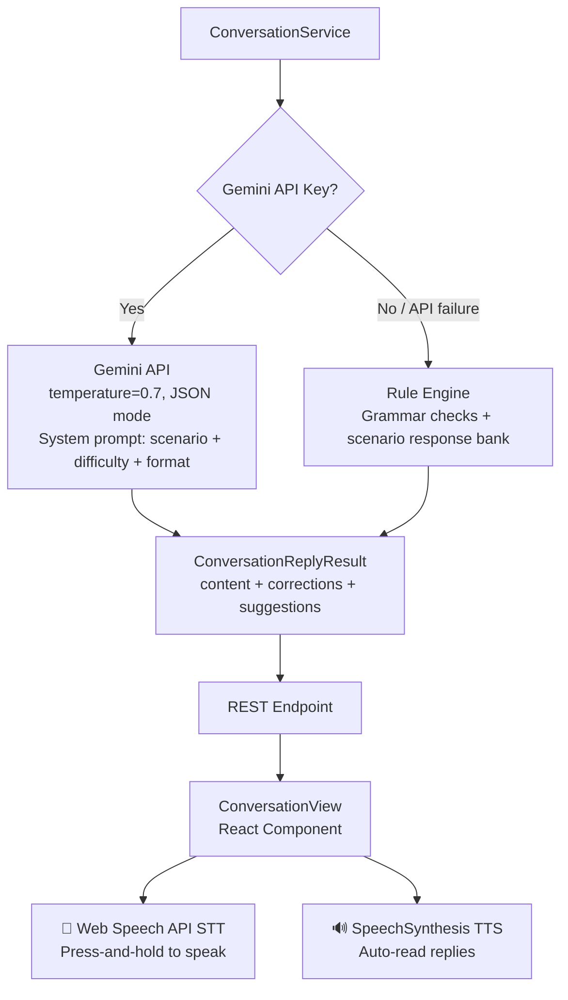

# @toeicpass/conversation-ai

> Reusable AI conversation practice module — TOEIC English speaking training, grammar correction, improvement suggestions. Plug and play.

**Gemini AI + Rule Engine dual-mode** · **Speech Recognition/Synthesis** · **TypeScript** · **React (optional)**

## Docs

| Document | Description |
|---|---|
| [SPEC.md](./SPEC.md) | Full specification — all type definitions, API reference, AI flow, scenario catalog |
| [INTEGRATION.md](./INTEGRATION.md) | Step-by-step integration guide — 6 steps from install to production |
| [CHANGELOG.md](./CHANGELOG.md) | Version changelog |
| [README.md](./README.md) | Chinese (中文) version of this document |

## Quick Start

### Install

```bash
npm install @toeicpass/conversation-ai
```

### Backend (30 seconds)

```typescript
import { ConversationService } from "@toeicpass/conversation-ai";

// Works without an API Key (rule engine mode)
const svc = new ConversationService({
  geminiApiKey: process.env.GEMINI_API_KEY, // optional
});

// List scenarios
const scenarios = svc.listScenarios(); // 8 built-in TOEIC scenarios

// Generate a reply
const reply = await svc.generateReply({
  scenarioId: "office-meeting",
  text: "I think we should meet on Friday.",
  history: ["Hello, when can we schedule the meeting?"],
});

console.log(reply.content);      // "Friday works. I will send a calendar invite."
console.log(reply.corrections);  // ["Remember to capitalize 'I'..."]
console.log(reply.suggestions);  // ["Try adding one supporting sentence..."]
```

### Frontend (30 seconds)

```tsx
import { ConversationView } from "@toeicpass/conversation-ai/web";
import type { ConversationApiFunctions } from "@toeicpass/conversation-ai/web";

const api: ConversationApiFunctions = {
  fetchScenarios: () => fetch("/api/conversation/scenarios").then(r => r.json()),
  sendReply: (p) => fetch("/api/conversation/reply", {
    method: "POST",
    headers: { "Content-Type": "application/json" },
    body: JSON.stringify(p),
  }).then(r => r.json()),
};

<ConversationView locale="zh" api={api} />
```

## Architecture



## Built-in Scenarios (8)

| Scenario | Difficulty | Category |
|---|---|---|
| 🏢 Office Meeting | ⭐ | office |
| 🍽️ Restaurant Order | ⭐ | restaurant |
| ✈️ Airport Check-in | ⭐⭐ | airport |
| 🏨 Hotel Reservation | ⭐⭐ | hotel |
| 📞 Phone Inquiry | ⭐⭐ | phone |
| 💼 Job Interview | ⭐⭐⭐ | interview |
| 📊 Product Presentation | ⭐⭐⭐ | meeting |
| 📋 Customer Complaint | ⭐⭐⭐ | phone |

## Key Features

| Feature | Description |
|---|---|
| Dual-mode AI | Gemini 2.0 Flash (primary) + Rule Engine (fallback), auto-degrade |
| Grammar correction | Real-time checks: capitalization, contractions, sentence length, punctuation |
| Improvement suggestions | Actionable tips from AI or rule engine |
| Voice practice | Press-and-hold STT + auto-read TTS |
| Bilingual UI | Chinese (zh) + Japanese (ja) |
| Custom scenarios | Pass your own scenarios array |
| Zero framework deps | Backend is pure TypeScript, works with any framework |

## API Reference

### Backend Exports (`@toeicpass/conversation-ai`)

| Export | Kind | Description |
|---|---|---|
| `ConversationService` | Class | Core service with dual-mode AI (Gemini + rule-based) |
| `DEFAULT_SCENARIOS` | Constant | 8 built-in TOEIC conversation scenarios |
| `ConversationScenario` | Interface | Scenario definition (id, title, difficulty, category) |
| `ConversationMessage` | Interface | Chat message with optional corrections/suggestions |
| `ConversationSession` | Interface | Full conversation session record |
| `ConversationReplyInput` | Interface | Input DTO for `generateReply()` |
| `ConversationReplyResult` | Interface | Output with content, corrections, suggestions |
| `ConversationServiceConfig` | Interface | Service configuration (API key, model, scenarios) |

### Frontend Exports (`@toeicpass/conversation-ai/web`)

| Export | Kind | Description |
|---|---|---|
| `ConversationView` | Component | Full-screen chat UI with speech support |
| `ConversationApiFunctions` | Type | API callback interface for host app injection |
| `ConversationViewProps` | Type | Component props |

## Backend Only?

No React required. The backend is pure TypeScript:

```typescript
import { ConversationService } from "@toeicpass/conversation-ai";
// React is an optional peerDependency — no error if not installed
```

## License

MIT
