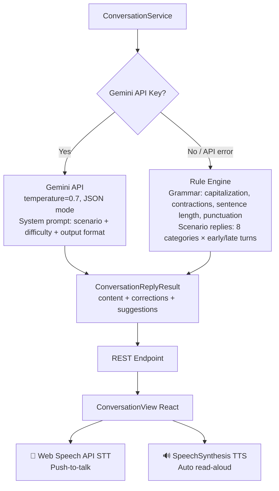

# @toeicpass/conversation-ai

> Reusable AI conversation practice module — TOEIC English speaking, grammar correction, improvement suggestions.

**Gemini AI + Rule Engine dual mode** · **Speech Recognition/Synthesis** · **TypeScript** · **React (optional)**

## Documentation

| Document | Description |
|---|---|
| [SPEC.md](./SPEC.md) | Full specification — all type definitions, API reference, AI flow diagram, scenario catalog |
| [INTEGRATION.md](./INTEGRATION.md) | Step-by-step integration guide — 6 steps from install to production |
| [CHANGELOG.md](./CHANGELOG.md) | Version changelog |

## Installation

```bash
npm install @toeicpass/conversation-ai
```

Or via monorepo workspace reference:
```json
{ "dependencies": { "@toeicpass/conversation-ai": "workspace:*" } }
```

## Quick Start — Backend

```typescript
import { ConversationService } from "@toeicpass/conversation-ai";

// Works without API key (rule engine mode)
const svc = new ConversationService({
  geminiApiKey: process.env.GEMINI_API_KEY, // optional
});

// List scenarios
const scenarios = svc.listScenarios(); // 8 built-in TOEIC scenarios

// Generate reply
const reply = await svc.generateReply({
  scenarioId: "office-meeting",
  text: "I think we should meet on Friday.",
  history: ["Hello, when can we schedule the meeting?"],
});

console.log(reply.content);      // "Friday works. I will send a calendar invite."
console.log(reply.corrections);  // ["Remember to capitalize 'I'..."]
console.log(reply.suggestions);  // ["Try adding one supporting sentence..."]
```

## Quick Start — Frontend

```tsx
import { ConversationView } from "@toeicpass/conversation-ai/web";
import type { ConversationApiFunctions } from "@toeicpass/conversation-ai/web";

const api: ConversationApiFunctions = {
  fetchScenarios: () => fetch("/api/conversation/scenarios").then(r => r.json()),
  sendReply: (p) => fetch("/api/conversation/reply", {
    method: "POST",
    headers: { "Content-Type": "application/json" },
    body: JSON.stringify(p),
  }).then(r => r.json()),
};

<ConversationView locale="zh" api={api} />
```

## Architecture



### Design Principles

- **Graceful Degradation**: When Gemini API is unavailable (no key, rate limit, network error), the service automatically falls back to a rule-based engine. Users always get a response.
- **Dependency Inversion**: The frontend `ConversationView` component receives API functions via props — no hard-coded fetch URLs or state management coupling.
- **Scenario-driven**: Each conversation session is anchored to a scenario with a defined context, category, and difficulty level. This constrains AI responses to TOEIC-relevant topics.

### Module Structure

```
src/
├── index.ts                  # Backend entry — exports ConversationService, scenarios, types
├── conversation.service.ts   # Core service: Gemini integration, rule engine fallback
├── scenarios.ts              # 8 built-in TOEIC conversation scenarios
├── types.ts                  # All TypeScript interfaces
└── css.d.ts                  # CSS module declarations

web/
├── index.ts                  # Frontend entry — exports ConversationView + types
├── conversationview.tsx      # Full conversation UI with speech I/O
└── types.ts                  # Frontend-specific types (ConversationApiFunctions)
```

### Exported Types

| Type | Description |
|---|---|
| `ConversationScenario` | Scenario definition — id, title, description, context, difficulty, category |
| `ConversationMessage` | Single message — role (user/assistant/system), content, corrections, suggestions |
| `ConversationSession` | Full session — scenario ID, message history, timestamps |
| `ConversationReplyInput` | Input to `generateReply()` — scenario ID, user text, history |
| `ConversationReplyResult` | AI output — content, corrections array, suggestions array |
| `ConversationServiceConfig` | Service config — `geminiApiKey` (optional) |

## Built-in Scenarios

| Scenario | Difficulty | Category |
|---|---|---|
| 🏢 Office Meeting | ⭐ | office |
| 🍽️ Restaurant Ordering | ⭐ | restaurant |
| ✈️ Airport Check-in | ⭐⭐ | airport |
| 🏨 Hotel Booking | ⭐⭐ | hotel |
| 📞 Phone Inquiry | ⭐⭐ | phone |
| 💼 Job Interview | ⭐⭐⭐ | interview |
| 📊 Product Presentation | ⭐⭐⭐ | meeting |
| 📋 Customer Complaint | ⭐⭐⭐ | phone |

## Features

| Feature | Details |
|---|---|
| Dual AI channel | Gemini 2.0 Flash (primary) + Rule Engine (fallback), automatic degradation |
| Grammar correction | Real-time checks for capitalization, contractions, sentence length, punctuation |
| Improvement suggestions | Actionable tips from AI or rule engine |
| Voice practice | Push-to-talk STT + auto read-aloud TTS |
| i18n | Chinese (zh) + Japanese (ja) |
| Custom scenarios | Pass a custom scenarios array to override defaults |
| Framework-agnostic backend | Pure TypeScript, works with any framework |

## Backend-only Usage

React is not required. The backend entry point is pure TypeScript:

```typescript
import { ConversationService } from "@toeicpass/conversation-ai";
// React is an optional peerDependency — no error if not installed
```

## License

MIT — see [LICENSE](./LICENSE)
